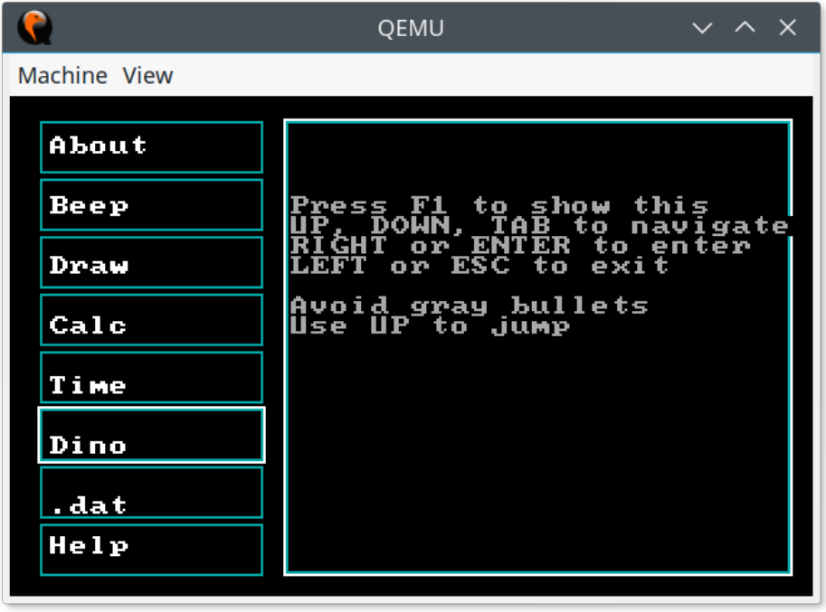
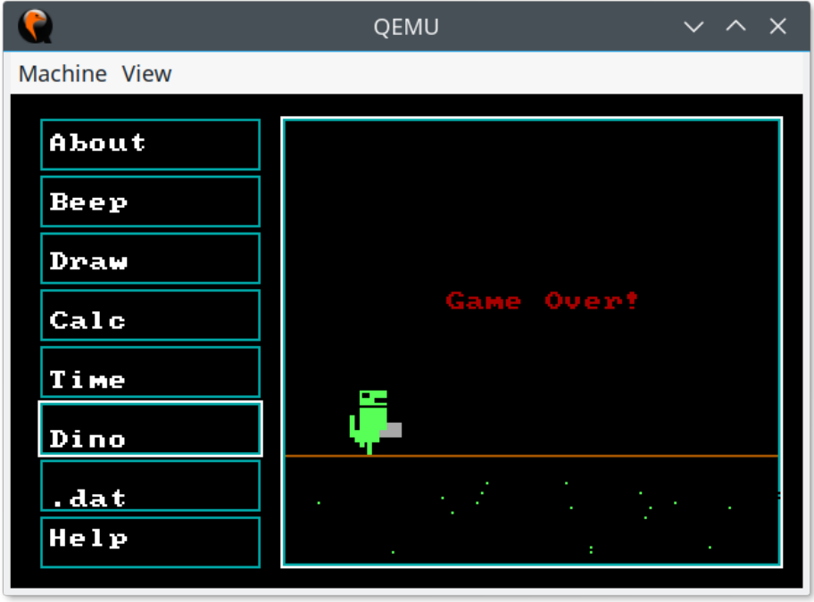

# SOMIPP Lab 6

This was a university task.  
Using an assembly language make a bootloader and a kernel that:

* can tell about itself
* can beep
* can draw triangles
* has an interactive calculator
* can show current time
* has a game
    * the game is about a dinosaur dodging bullets.
* load\save a file

Every screen had a help menu opened with F1. 

I keep it for nostalgy - the dinosaur game.

## Screens

## Setup
Prerequisites:
* `fasm` assembler
* `make` build system
* `qemu` emulator

Commands:
* `make` to just compile - unfortunately doesn't work, since I forgot how to write the kernel at correct offset.
* `make run` to compile and launch the image in emulator.
